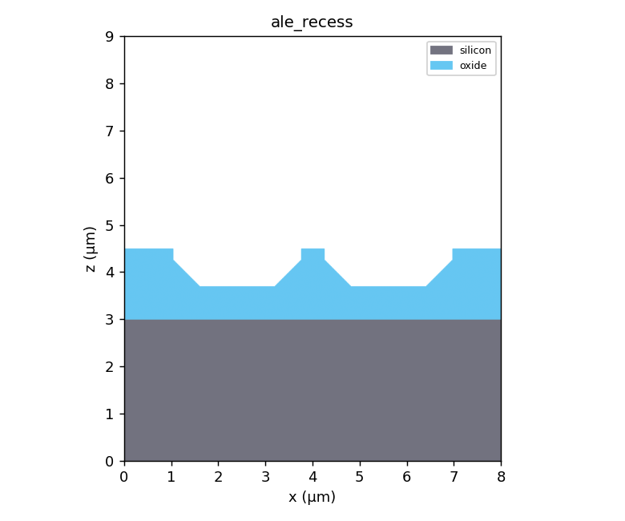

# 半導体プロセス 3D シミュレータ

ボクセルベースで半導体プロセス（フォトリソ・成膜・エッチング・拡散・酸化・CMP など）を
逐次適用し、3D / 2D 断面で確認できる Python 製シミュレータです。

## 特長

- **充填ボリューム表現**: 断面が空洞にならず、常に中身が詰まって表示されます。
- **自由な断面**: X / Y / Z / 角度指定 / マウス操作の任意断面。2D 断面ビューでは
  クリック 2 点で膜厚・CD を実寸（µm）測定できます。
- **豊富な工程**: PHOTO / CVD / PVD / DRY / WET / DIFFUSION / OXIDE / CMP / STRIP に加え、
  IMPLANT（イオン注入）/ ANNEAL（ドライブイン拡散）/ EPI（選択エピ成長）/
  KOH（異方性ウェット・斜め側壁）/ FILL（ダマシン埋込）/ LIFTOFF / DRIE（深掘りエッチ）/
  SPUTTER（イオンミリング）/ REFLOW（熱リフロー）/ CLEAN（プラズマクリーン）。
  材料は High-k(HfO₂)・TaN バリア・シリサイド(NiSi) など 16 種に対応。各材料は残留膜応力(MPa)を持ち、Stoney 則による等価ウェハ反りを計測できます。
- **任意角度パターン**: 回転矩形・帯・周期ライン（グレーティング）。
- **メトロロジ**: 膜厚マップ・段差・体積・アスペクト比・断面 CD に加え、表面粗さ(RMS)・側壁角・界面面積・トレンチ閉塞(ボイド)判定・ビア充填品質(`via_fill_quality`)・側壁ボーイング(`sidewall_bowing_um`)・段差被覆性(`conformality_pct`)・パターン密度(`pattern_density_map`/`pattern_density_stats`)・平坦化 DOF バジェット(`planarization_dof_check`, 表面トポグラフィの高低差をリソの焦点深度 DOF と比較し焦点外れ領域の面積率を算出。CMP 後の平坦性が後続パターニングの解像に十分か検証)・サーマルバジェット(`thermal_budget`)・膜応力とウェハ反り(`film_stress_thickness`/`wafer_bow_um`, Stoney 則)・局所応力集中(`stress_concentration_map`/`max_stress_concentration`, 界面の応力ミスマッチ Δσ×幾何集中係数 Kt でクラック/剥離リスク箇所=凸角・高応力界面を検出)・CTE 不整合熱応力(`thermal_mismatch_stress`, 各膜が基板の熱膨張に拘束されることで生じる二軸熱応力 σ=E/(1−ν)·(α_ref−α_film)·ΔT を材料別に算出。線膨張係数 cte_ppm_k とヤング率 youngs_modulus_gpa を使用し、冷却（ΔT<0）で高 CTE 膜=引張・低 CTE 膜=圧縮、最弱材料を特定。熱サイクル/パッケージ応力の評価)・歪み Si 移動度(`strained_mobility`/`channel_strain_mobility`, 機械応力のピエゾ抵抗効果によるキャリア移動度変化 Δμ/μ=−π_l·σ。電子（π_l<0）は引張応力・正孔（π_l>0）は圧縮応力で移動度が向上する歪み CMOS（nMOS=引張ライナ・pMOS=圧縮ライナ）を再現。チャネル材料の残留応力から実効移動度を算出)・薄膜光学反射率(`optical_reflectance`, 列の薄膜積層を特性行列法（TMM）で解く垂直入射エネルギー反射率 R=|r|²。各層の複素屈折率 N=n−ik（refractive_index_n/extinction_k）と厚みから合成し、λ/4 反射防止膜（n≈√(n0·ns)）で R→0・裸基板で Fresnel・λ/2 膜は光学的に不可視を再現。ARC 設計/反射測光の評価)・ダマシンディッシング深さ(`dishing_depth_um`)・層間界面粗さ(`interface_roughness_um`)・接合深さと深さ方向ドーパントプロファイル(`junction_depth_um`/`dopant_depth_profile`)・表面凹凸の支配波長(`dominant_wavelength_um`, 2D FFT)・埋め込みボイドの連結成分統計(`void_metrics`: 個数/最大体積/縦方向高さ)・線幅ラフネス(`line_width_roughness_um`, LWR)・限界寸法均一性(`cd_uniformity`, CDU: 平均 CD/3σ/範囲)・導体の電気的導通/オープン判定(`electrical_continuity`, 連結成分が指定軸の両端に到達するか)・配線抵抗推定(`line_resistance_ohm`, 断面積を考慮した直列抵抗 R=Σρ·Δl/A, 細り箇所で増大・断線で inf)・DRC 最小間隔(`min_spacing_um`, 2 材料間の最小距離=ショート不良リスク, 接触で 0)・シート抵抗(`sheet_resistance_ohm_sq`, Rs=ρ/t, 4 探針相当の薄膜評価)・温度依存抵抗(`resistance_at_temperature`, R(T)=R₀·(1+TCR·ΔT)。材料の抵抗温度係数 tcr_per_k で高温時の抵抗増を評価, 自己発熱との正帰還検討に有用)・ドーピング依存移動度(`carrier_mobility`, Caughey–Thomas モデル µ(N)=µ_min+(µ_max−µ_min)/(1+(N/N_ref)^α)。不純物散乱で移動度がドーピングとともに低下し、低ドープで格子散乱律速の µ_max（電子 1360/正孔 495）・高ドープで µ_min（電子 92/正孔 47.7）に漸近、N=N_ref で中点。固定移動度に代えてプロセス条件依存の実効移動度を評価)・体積抵抗率/Irvin 曲線(`bulk_resistivity_ohm_cm`, ドープ Si の ρ=1/(q·N·µ)。多数キャリア濃度 N とドーピング依存移動度 µ(N) から算出し、n 型 N=1e16→約 0.5 Ω·cm と Irvin 曲線に一致。導電率 σ=1/ρ も併せて返し基板/拡散層の抵抗率設計に有用)・拡散係数/アインシュタイン関係(`diffusion_coefficient`, D=µ·(kT/q)。ドーピング依存移動度 µ(N) と熱電圧 Vt から拡散係数を算出し、低ドープ電子で D≈35 cm²/s（正孔 ≈13）と教科書値に一致。拡散電流/接合電流の基礎)・デバイ長(`debye_length`, 誘電遮蔽長 L_D=√(εs·kT/(q²·N))。電位擾乱が遮蔽される特性長で空乏層エッジの広がりを与え、N=1e16 で約 40nm・L_D∝1/√N。微細空乏制御の指標)・少数キャリア拡散長(`diffusion_length`, L=√(D·τ)。寿命 τ の間に少数キャリアが拡散で進む距離で、太陽電池/バイポーラ/接合の収集長を決める。D≈35・τ=1µs で L≈59µm, L∝√τ)・コンタクト面積/接触抵抗(`contact_area_um2`/`contact_resistance_ohm`, 面ペア数×pitch² と Rc=ρc/A)・寄生容量(`parasitic_capacitance_ff`, 面対向ライン走査による平行平板積算 C=Σε0·εr·pitch²/d。平行平板の解析値に厳密一致し配線間カップリング/対基板容量を評価。各材料の比誘電率 rel_permittivity を使用)・寄生容量(静電界ソルバ)(`parasitic_capacitance_field_ff`, 断面で ∇·(εr∇φ)=0 を有限体積・疎行列直接解法で解き電束から容量を算出。全面平板では解析値に一致し、有限幅電極ではフリンジ容量を上乗せ=平行平板近似より大)・Maxwell 容量行列(`capacitance_matrix_ff`, 複数導体を順に 1V 励起・他接地で解き、自己容量 C_kk と全結合容量 C_ik を含む完全な容量行列を抽出。中央導体による遮蔽も再現する標準的 RC 抽出)・対全導体総容量(`total_net_capacitance_ff`, 対象導体を 1V・他の全導体を接地として解くドライバ実効負荷容量。各隣接容量の和に相当しゲート遅延の入力に使える)・電源 IR ドロップ(`ir_drop_v`, ΔV=I·R による電源配線の電圧降下=パワーインテグリティ検証)・RC 遅延(`rc_delay_ps`, 集中定数 τ=R·C による配線遅延の一次見積り)・伝送線路パラメータ(`transmission_line_params`, TEM 関係 L'·C'_vac=μ0ε0 から特性インピーダンス Z0=√(L'/C')・インダクタンス・信号速度 v=c/√εr_eff・伝搬遅延を導出。高速配線の RLC 検証。インダクタンスは誘電体に依らず幾何のみで決まる)・分布 RC Elmore 遅延(`elmore_delay_ps`, 配線を薄切りした τ=Σ(ΣR)·C。一様線で ½·RC となり分布効果を捕捉)・ロジックゲート遅延(`gate_switching_delay_ps`, CV/I モデル τ=C_load·Vdd/I_drive。MOS 飽和駆動電流と負荷容量からスイッチング遅延を算出)・CMOS 消費電力(`mos_power_dissipation`, 動的電力 P_dyn=α·C·Vdd²·f ＋ 静的リーク電力 P_static=Ioff·Vdd を合算。周波数を上げると動的支配・低活性/微細化では静的支配となるトレードオフを再現。動的/静的の比率も算出)・リングオシレータ発振周波数(`ring_oscillator_frequency`, 奇数 N 段インバータをリング接続した発振周波数 f_osc=1/(2·N·τ_pd)。段遅延 τ_pd（CV/I）から算出し段数に反比例・高 Vdd で高速化を再現。素子速度を測る標準テスト回路)・CMOS インバータ VTC/雑音マージン(`cmos_inverter_vtc`, 作製したゲート積層の Cox を共有する n/pMOS（EKV 連続電流）で pull-down/pull-up 電流が釣り合う出力 Vout を二分法で解き直流伝達特性 (VTC) 全体を算出。反転しきい値 VM（Vin=Vout）・単位利得点 VIL/VIH（dVout/dVin=−1）・出力 VOH/VOL・雑音マージン NMH=VOH−VIH/NML=VIL−VOL・遷移点の最大電圧利得を抽出。対称設計（βp=βn・|Vthp|=Vthn）で VM=Vdd/2 を再現し、βp/βn や |Vthp| の非対称で VM が Vdd 側/接地側へスキューする様子も再現。デジタル静雑音耐性の評価)・スルーレート/全電力帯域(`slew_rate`, 出力段が電流制限で負荷容量を駆動する最大電圧変化率 SR=I_drive/C_load と、振幅 V_peak の正弦波をスルー歪み無く出力できる上限周波数 f_FP=SR/(2π·V_peak)。容量に反比例・大振幅ほど低帯域。アナログオペアンプの大信号性能指標)・MOS ゲート容量/EOT(`mos_gate_capacitance`, ゲート積層の直列容量 Cox=ε0/Σ(tᵢ/εrᵢ) と等価酸化膜厚 EOT=εr(SiO2)·Σ(tᵢ/εrᵢ)。high-k で EOT 薄化=Cox 増を評価)・ゲート直接トンネルリーク(`gate_tunneling_leakage`, ゲート酸化膜を量子トンネルで貫くリーク電流密度 J_g=J0·Vg²·exp(−t_phys/t_char)。物理膜厚に指数依存し、同じ EOT でも high-k（HfO2 等）採用で物理膜厚を厚くできるため J_g を桁違いに下げられる（high-k 採用の主動機）を再現。待機電力/ゲートリーク評価)・短チャネル Vth/DIBL(`short_channel_vth_v`, Vth=Vth_long−sce_amp·exp(−L/λ)−DIBL·Vds。チャネル長ロールオフとドレイン誘起障壁低下を評価)・ボディ効果/基板バイアス(`body_effect`, ソース・基板間逆バイアス Vsb による Vth 変調 Vth(Vsb)=Vth0+γ(√(2φF+Vsb)−√(2φF))。ボディ係数 γ=√(2εs·q·Na)/Cox（∝√Na）を抽出し、スタック素子の実効 Vth 上昇やバックバイアスによる Vth 調整を評価)・真性キャリア濃度/バンドギャップ(`intrinsic_carrier_concentration`/`bandgap_ev`, Si の ni(T)=√(Nc·Nv)·exp(−Eg/2kT)∝T^1.5·exp(−Eg(T)/2kT)（300K で 1×10¹⁰ cm⁻³ に規格化）と Varshni バンドギャップ Eg(T)=Eg(0)−α·T²/(T+β)（Eg(300)≈1.12eV）。温度上昇で Eg 縮小・ni は約 8K ごとに倍増する指数増加を再現し、接合リーク/リテンション/オフ電流の温度加速の根源を与える)・接合リーク電流(`junction_leakage_a`, 逆リーク∝ni(T)²·面積で温度加速=待機電力/リテンション評価)・DRAM リテンション時間(`dram_retention_time_s`, t_ret=C·ΔV/I_leak。蓄積容量と接合リークの結合でリフレッシュ周期を評価)・ソフトエラー臨界電荷(`critical_charge_fc`, Q_crit=C·V。SEU 耐性=記憶ノードのビット反転耐性)・MOS C-V 特性/しきい値電圧(`mos_cv_curve`/`threshold_voltage_v`, 空乏近似による高周波 C-V 曲線=蓄積 Cox→空乏→反転 Cmin と Vth=Vfb+2φF+√(4εs·q·Na·φF)/Cox・最大空乏層幅。ドーピング依存を評価)・pn 接合 空乏層容量(`junction_capacitance`/`junction_cv_curve`, ビルトイン電位 Vbi・空乏層幅 W(V)・接合容量 Cj=εs/W。1/Cj²-V の線形性=C-V ドーピングプロファイリング, x 切片=−Vbi を再現)・pn 接合 降伏電圧(`junction_breakdown_voltage`, 一方的階段接合のアバランシェ降伏電圧 BV=60·(Eg/1.1)^1.5·(N_light/1e16)^−¾（Sze 経験式, BV∝N^−¾）と、降伏時の空乏層幅 W_BD=√(2εs·BV/qN)・最大電界 E_crit=2BV/W_BD を算出。軽ドープ側が支配し高ドープほど低 BV。パワー素子の耐圧設計に有用)・アバランシェ増倍係数(`avalanche_multiplication`, Miller 経験式 M=1/(1−(V/BV)^n)。逆バイアス V が降伏 BV に近づくと衝突電離でキャリアが雪崩増倍し、V≪BV で M→1・V→BV で M→∞。Miller 指数 n（3〜6）で膝の鋭さが決まる。APD 利得・BJT の BVceo・パワー素子 SOA を決める。junction_breakdown_voltage の BV と連携)・ダイオード I-V(`diode_current`/`diode_iv_curve`, Shockley 式 I=Is·(exp(V/nVt)−1)。順方向指数・逆方向飽和(−Is)・直列抵抗による高電流飽和を再現)・ショットキーバリアダイオード(`schottky_diode_current`/`schottky_saturation_current`, 金属-半導体接触の熱電子放出 Js=A*·T²·exp(−Φ_B/kT)（Richardson 式, A*=実効リチャードソン定数）と I=Is·(exp(V/nVt)−1)。障壁 Φ_B が低い・温度が高いほど Js が指数的に増え、pn 接合（Shockley）より桁違いに大きい飽和電流＝低い立ち上がり電圧を再現。直列抵抗で高電流制限。高速整流/低 Vf のパワー・RF 用途)・フォトダイオード応答度(`photodiode_responsivity`, 量子効率 η の光検出器の応答度 R=η·q·λ/(h·c)=η·λ[µm]/1.23984 [A/W]。波長が長いほど（光子数が多いほど）R 大だが、バンドギャップより光子エネルギーが小さい λ>λ_c では吸収されず R=0。遮断波長 λ_c=hc/Eg（Si: Eg=1.12eV→1.107µm）。850nm・η=0.8 で R≈0.55 A/W と一致。光検出器/イメージセンサの量子効率評価)・MOS 小信号特性(`mos_small_signal`, ドレイン電流の数値微分から トランスコンダクタンス gm=∂Id/∂Vg・出力コンダクタンス gds=∂Id/∂Vd・真性利得 Av=gm/gds を算出。飽和域で高利得・λ 小ほど高利得を再現)・MOS gm/Id 効率(`mos_gm_id_efficiency`, トランスコンダクタンス効率 gm/Id（1/V）。弱反転で理論上限 1/(n·Vt)≈30〜38 に漸近し強反転で 1/Vov として低下。消費電流あたりの利得効率を表す現代アナログ設計（gm/Id 法）の中核指標)・MOS アーリー電圧 VA(`early_voltage`, 出力特性の傾き外挿が Vd 軸を切る点 VA=Id/gds（飽和域の出力抵抗指標）。チャネル長変調 λ に対し VA≈1/λ となり、真性利得を Av=gm/gds=(gm/Id)·VA と効率 gm/Id とアーリー電圧の積に分解。長チャネルほど高 VA=高利得)・MOS 遮断周波数 fT(`mos_cutoff_frequency`, 電流利得カットオフ fT=gm/(2π·Cgg) とトランジット時間 τ=Cgg/gm。小信号 gm とゲート総容量 Cgg から RF/アナログの最重要 FoM を算出。過剰電圧で gm 増→fT 上昇=高速動作を評価)・ミラー効果(`miller_effect`, 反転増幅段の帰還容量 Cf がミラーの定理で入力側に C_in=Cf·(1+|Av|)・出力側に C_out=Cf·(1+1/|Av|) として見える。利得が大きいほど入力容量が膨れ、源抵抗 Rs 指定時は入力極帯域 f_in=1/(2π·Rs·C_in) も算出。利得と帯域のトレードオフ＝ミラー帯域制限を再現)・MOS 伝達特性/サブスレショルドスイング(`mos_transfer_characteristics`, Id-Vg 掃引から SS=min(ΔVg/Δlog10 Id)≈n·(kT/q)·ln10≈n·60mV/dec・Ion=Id(Vdd)・Ioff=Id(0)・Ion/Ioff 比を抽出。デジタルのオフリーク/待機電力とスイッチ品質を評価)・MOS チャネル熱雑音(`mos_thermal_noise`, チャネル抵抗の熱揺らぎによるドレイン電流雑音 S_id=4kT·γ·gm と入力換算電圧雑音 √(4kTγ/gm)。小信号 gm から算出し gm 大ほど低雑音化・温度比例を再現。アナログ/RF の雑音指数評価の基盤)・MOS フリッカ(1/f)雑音(`mos_flicker_noise`, ゲート酸化膜界面トラップ起因の低周波雑音 S_vg=Kf/(C_ox·f)（周波数に反比例）と、熱雑音と等しくなるノイズコーナー周波数 fc=Kf·gm/(C_ox·4kTγ) を算出。コーナー以下で 1/f 支配・以上で白色熱雑音支配を再現。低周波アナログの雑音設計の基盤)・MOS マッチング/Pelgrom 則(`mos_mismatch`, 対向ペア素子のしきい値ばらつき σ(ΔVth)=A_VT/√(W·L)・電流係数ばらつき σ(Δβ/β)=A_β/√(W·L)。ゲート活性面積に反比例する面積平均則を再現し、面積 4 倍で σ 半減。アナログ/コンパレータのオフセット見積りの基盤)・MOS I-V 特性(`mos_drain_current`/`mos_iv_curve`, EKV 連続モデルで弱反転〜強反転・三極管〜飽和を単一式で滑らかに表現。飽和電流 Idsat∝(Vg−Vth)²・サブスレショルド傾斜 SS=n·(kT/q)·ln10≈n·60mV/dec・チャネル長変調を再現。区分モデルの不連続を解消)・電流密度/EM 信頼性(`current_density_stats`/`electromigration_risk`, J=I/A をスライス毎に算出しネッキング箇所の最大 J を材料の許容電流密度 em_jmax_a_cm2 と比較)・電流密度プロファイル(`current_density_profile`, 配線に沿った J(x) 配列でネッキング=EM ホットスポット位置を可視化)・TLM 接触抵抗抽出(`tlm_extract`, コンタクト間隔×全抵抗の直線回帰から シート抵抗・接触抵抗 Rc・伝送長 Lt を抽出)・絶縁破壊判定(`dielectric_breakdown`, 2 導体間の最小間隙から最大電界 E=V/g を求め誘電体の破壊電界 breakdown_field_mv_cm と比較)・歩留り推定(`yield_estimate`, 欠陥密度から Poisson/Murphy/Seeds モデルで歩留りを算出。`killer_defect_count` で検出キラー欠陥数を集計)・クリティカルエリア解析(`critical_area_short_um2`/`caa_short_yield`, 円形欠陥が 2 配線をブリッジさせ得る臨界面積を距離変換で算出し、欠陥サイズ分布 1/x³ で積分して期待故障数 λ→ショート歩留り Y=exp(−λ) を推定。配線間隔・欠陥密度依存)・アンテナ比(`antenna_ratio`, プラズマ帯電損傷 DRC。ゲート酸化膜に接続した導体の露出表面積/ゲート面積でプロセスアンテナ効果によるゲート絶縁破壊リスクを判定)・経時劣化寿命(`electromigration_mttf`/`em_lifetime_wafer`, Black の式 MTTF=A·J⁻ⁿ·exp(Ea/kT) による EM 寿命。`tddb_lifetime`, E モデル TTF=A·exp(−γE)·exp(Ea/kT) による絶縁膜経時破壊寿命。電流密度/電界/温度に対する寿命予測)・EM Blech 不死条件(`blech_immortal`, 電流密度×配線長 j·L が臨界値未満なら応力勾配が EM 駆動力と釣り合い故障しない=短配線の EM 免疫を判定)・自己発熱結合 EM 寿命(`em_lifetime_self_heated`, ジュール発熱の温度上昇を接合温度に加えて Black 式で評価。高電流の自己発熱が EM 寿命を縮める正帰還を再現)・NBTI しきい値劣化(`nbti_vth_shift`, |ΔVth|=A·exp(γ|V|)·exp(−Ea/kT)·tⁿ。ストレス電圧/温度/時間による pMOS の経時 Vth シフトを評価)・HCI 寿命(`hci_lifetime`, ホットキャリア注入 TTF=A·exp(B/Vds)。ドレイン電圧律速の経時劣化寿命を評価)・縦方向熱抵抗(`thermal_resistance_k_w`/`thermal_resistance_map`, 各材料の熱伝導率 thermal_conductivity_w_mk から基板→表面の直列熱抵抗 R=ΣΔz/(k·A) を列毎に算出し並列合成。Cu ビアは低熱抵抗・low-k は熱障壁=ホットスポット検出)・自己発熱温度上昇(`temperature_rise_k`/`joule_self_heating_k`, ΔT=P·Rth。配線のジュール発熱 P=I²R から接合温度上昇を評価)・熱過渡応答/熱時定数(`thermal_time_constant_s`/`transient_temperature_rise_k`, 熱抵抗 R_th と固体総熱容量 C_th=Σρ·c_p·ΔV から熱時定数 τ_th=R_th·C_th を求め、ΔT(t)=P·R_th·(1−e^(−t/τ)) の一次 RC 過渡応答を評価。t=τ で定常の約 63%、材料の体積熱容量 volumetric_heat_capacity_j_m3k を使用)・2.5D 熱拡散ソルバ(`temperature_field_2d`/`peak_temperature_rise_k`, 断面で ∇·(k∇T)=−q を疎行列で解き発熱源+基板ヒートシンクから温度分布を算出。横方向ヒートスプレッディングとホットスポットを捕捉, 均一発熱で P·Rth に一致)・完全 3D 熱拡散ソルバ(`temperature_field_3d`/`peak_temperature_rise_3d`, ∇·(k∇T)=−q を 3D 全体で解き局所発熱を x・y・z の 3 方向に等方拡散。点状ホットスポットを 2.5D 断面より正確に評価)・エッチ残渣/ストリンガー検出(`etch_residue_metrics`, 微小孤立片の個数/総体積/最大縦横比でブロックエッチ残り・側壁ストリンガーを判定)・アンダーカット検出(`undercut_um`, マスク開口に対する被加工材料の横方向後退量=等方/過剰サイドエッチ不良)・ピンホール検出(`pinhole_metrics`, 膜に囲まれた貫通抜けの個数/面積=カバレッジ/パーティクル起因リーク欠陥)・統合不良レポート(`defect_report`, ボイド/ピンホール/エッチ残渣/ディッシング/反りを横断検査した機械可読辞書, CLI `--json-report` の `defects` に統合)など計測ヘルパ（`semisim/metrology.py`）。
  人が読めるテキスト計測レポート（`metrology.report`）も生成できます。
  配線 1 本の総合特性（抵抗・容量・インダクタンス・Z0・RC/Elmore/伝搬遅延・電流密度・
  EM 信頼性・IR ドロップ・断線判定）を 1 コールで集計する `interconnect_report` も用意。
- **リソ プロセスウィンドウ解析**: 空間像（aerial image）モデル（`semisim/litho.py`）で、
  マスク開口から印刷 CD を計算し、焦点・露光量に対する CD 応答（`bossung`）、
  プロセスウィンドウ（被写界深度 DOF・露光裕度 EL, `process_window`）、エッジ配置誤差
  （`edge_placement_error_um`）、マスク誤差増幅係数（`meef`）を検証できます。
  しきい値=0.5 較正によりベストフォーカスで CD バイアスがほぼ 0、解像限界付近で MEEF が増大します。
  さらに `monte_carlo_cd` で露光量・焦点のばらつき（プロセス変動）に対する印刷 CD 分布を
  モンテカルロ計算し、限界寸法均一性（CDU=3σ）と規格内歩留りを統計的に評価できます。
- **数値ソルバの収束検証**: 静電界容量・熱拡散ソルバが格子細分で解析解へ収束することを
  `estimate_convergence_order`（誤差≈C·hᵖ の次数 p を最小二乗推定）で定量検証できます。
  いずれも約 1 次精度（p≈1）で解析解に収束することを確認済み（`tests/test_solver_convergence.py`）。
- **プリセットレシピ**: 代表的な 13 フロー（ダマシン・MOSFET・LDD MOSFET・KOH・DRIE・TSV 貫通ビア・サリサイドゲート・薄化 3D-IC 等）をメニューから即読込（`semisim/presets.py`）。
- **設定の永続化**: 最後に使ったフォルダ・最近開いたレシピ・既定ウェハ設定・ウィンドウ位置を
  保存し次回起動時に復元（`semisim/settings.py`、`~/.semisim/settings.json`）。
- **アンドゥ / リドゥ**、レシピの JSON 保存 / 読込、STL エクスポート、スナップショット
  キャッシュ（上限付き）による高速プレビュー。

## セットアップ

Windows (PowerShell):

```powershell
py -m venv .venv
.\.venv\Scripts\Activate.ps1
pip install -r requirements.txt
```

Linux / macOS:

```bash
python3 -m venv .venv
source .venv/bin/activate
pip install -r requirements.txt
```

開発用ツール（pytest / ruff / mypy）も入れる場合:

```bash
pip install -e ".[dev]"
```

## 実行

```powershell
py main.py
```

### コマンドライン（GUI 不要）

レシピ JSON や組み込みプリセットをヘッドレスで実行し、計測レポートを表示できます。
CI やバッチ処理に便利です。

```powershell
# プリセットを実行してレポート表示
py -m semisim --preset "MOSFET フロー"

# プリセット一覧
py -m semisim --list-presets

# レシピ JSON を実行し、レポート・STL・断面 PNG を出力
py -m semisim recipe.json --report out.txt --stl shape.stl --png slice.png

# 中央列の縦方向材料スタックを CSV 出力（依存なし、SEM/TEM 断面比較用）
py -m semisim --preset "MOSFET フロー" --csv-column column.csv

# 特定材料を非表示にして PNG/STL 出力（例: 酸化膜を隠して下層を確認）
py -m semisim --preset "MOSFET フロー" --png cs.png --hide oxide,poly

# 2 パラメータ同時採引（実験計画法）。全組合せの計測値を CSV 出力
py -m semisim recipe.json --sweep2 "4.depth_um:0.3:0.7:0.2,5.taper_deg:0:30:15"

# 熱工程のサーマルバジェット（実効拡散長）を表示
py -m semisim --preset "拡散＋アニール" --thermal-budget
```

## テスト

エンジン部は GUI なしで完全にテストできます（pytest）。

```powershell
pytest
```

3D 可視化や処理結果の断面 PNG を生成して目視確認する場合:

```powershell
py tools\render_gallery.py
```

生成された PNG は `docs/gallery/` に出力されます。

## ギャラリー（断面例）

各プロセスを実行したウェハの中央断面（XZ 面）です。

| 例 | 内容 |
| --- | --- |
|  | イオン注入による埋込ドープ層（レジストで中央を遮蔽） |
|  | KOH 異方性エッチの V 溝（54.7° 側壁） |
|  | DRIE 深掘りトレンチ（側壁スキャロップ） |
|  | ALE 原子層エッチによる nm 精度・高選択リセス（等方成分でマスク下を後退） |
|  | Cu ダマシン配線（TiN バリア＋CMP 平坦化） |
|  | 選択エピタキシャル成長（酸化膜開口部のみ） |
|  | 簡易 MOSFET フロー（ゲート＋ソース/ドレイン） |

## 使い方説明書（HTML）

各プロセス操作の断面スクリーンショットと説明・パラメータ・コード例をまとめた HTML マニュアルを `docs/manual/index.html` に用意しています（ブラウザで開いて閲覧）。再生成は次のコマンドです。

```
py tools/build_manual.py
```

## 工程一覧

| タイプ | 名称 | 概要 |
| --- | --- | --- |
| PHOTO | フォトリソ | レジスト塗布＋現像でパターニング |
| CVD | CVD 成膜 | 等方コンフォーマル成膜（負荷効果でパターン密度依存の膜厚変化に対応） |
| ALD | ALD 成膜 | サイクル数×1サイクル成長量で nm 精度の超コンフォーマル膜 |
| PVD | PVD 成膜 | 指向性成膜（段差被覆率でシャドーイング） |
| DRY | ドライエッチ | 異方性エッチ（垂直・オーバーエッチ対応） |
| WET | ウェットエッチ | 等方エッチ（アンダーカット） |
| ALE | 原子層エッチ | サイクル数×1サイクル除去量で nm 精度・自己制限・高選択のエッチ（ALD の対）。`anisotropy` で等方コンフォーマル〜純垂直を切替 |
| DIFFUSION | 拡散 | 表面からの不純物拡散 |
| IMPLANT | イオン注入 | 投影飛程＋縦/横ストラグルのガウス濃度分布で埋込ドープ |
| ANNEAL | アニール | ドーパントのドライブイン（等方再分布） |
| RTP | 急速熱処理 | 浅く横拡散を抑えた活性化（スパイクアニール、`lateral_factor`で横/縦比を制御） |
| OXIDE | 熱酸化 | 露出 Si を消費し SiO₂ 成長（消費比は可変、既定 45/55 則） |
| SALICIDE | シリサイド形成 | 露出 Si／ポリ上のみ自己整合でシリサイド化（`react_poly`でゲート反応を制御） |
| SPACER | スペーサ形成 | コンフォーマル成膜＋異方性エッチバックで段差の垂直側壁にのみ材料を残す（ゲートスペーサ等） |
| ALE | `cycles` / `etch_per_cycle_nm` / `anisotropy` | サイクル数×1サイクル除去量で除去深さを精密制御（自己制限）。`anisotropy`（0=等方コンフォーマル/1=純垂直）で指向性を切替。対象以外の材料で完全停止（高選択比） |
| EPI | エピ成長 | 露出シリコン上のみに選択的単結晶成長 |
| KOH | 異方性ウェット | 結晶面に沿った斜め側壁（V 溝・台形） |
| FILL | 埋込（ダマシン） | 開口・トレンチをボトムアップで金属充填。高 AR でキーホール空隙 |
| SPINON | スピンオン平坦化 | 全面を液状材料で覆い上面を平坦化（SOG/SOD） |
| DRIE | 深掘りエッチ | 高アスペクト比の深掘り（スキャロップ / RIE ラグ） |
| SPUTTER | スパッタエッチ | 材料非選択の指向性物理エッチ（イオンミリング、等方成分で横アンダーカット） |
| REFLOW | 熱リフロー | 角を丸めて表面を平滑化（モルフォロジ閉/開処理） |
| CLEAN | プラズマクリーン | 露出表面を薄く等方除去（デスカム／残渣除去） |
| LIFTOFF | リフトオフ | レジストとその上の膜を一括除去 |
| CMP | CMP 平坦化 | 上面研磨で平坦化（基板保護・研磨ストップ層対応） |
| BACKGRIND | 裏面研削 | 基板を裏面（底）から研削しウェハを薄化（3D-IC/パッケージ。デバイス層は保護） |
| STRIP | 剥離 | 指定材料を全除去 |

## 主なパラメータ解説

各工程の代表的なパラメータと物理的な意味は次のとおり。寸法はすべて µm 指定で、
内部的に `WaferConfig.pitch_um` でボクセル数へ丸められる（最小 1 ボクセル）。

| 工程 | パラメータ | 意味・効果 |
| --- | --- | --- |
| PHOTO | `polarity` | `positive`=開口部のレジストを除去 / `negative`=開口部以外を除去。空マスクは全面開口扱い |
| PHOTO | `edge_blur_sigma_um` | 光学解像度有限による角の丸め（OPC 前の生パターン）。マスクをガウスぼかし後に二値化（0=無効） |
| PVD | `step_coverage` | 0=完全シャドーイング（窪み底に成膜されない）/ 1=完全コンフォーマル。窪み深さに比例して膜厚を減衰 |
| PVD | `overhang` | オーバーハング / ブレッドローフィング。開口上端の隅が庇状に横へ張り出し、狭い開口では合体して上部を塞ぎキーホールボイドを残す（膜厚比、0=無効） |
| PVD | `tilt_deg` | 斜め蒸着の入射角（度, 鉛直から）。+x からの斜め入射で背の高い構造の風下側に影ができ膜が付かない（電子ビーム蒸着のシャドーイング/リフトオフ, 0=真上） |
| CVD | `loading` | 負荷効果（0〜1）。パターン密度（基板より高い列の割合）が高いほど反応種が枯渇して膜が薄くなる。0 で従来どおり一定厚 |
| CVD | `roughness_um` / `seed` | 成膜表面の RMS ラフネス（µm）。膜上面を平均 0・標準偏差 roughness_um のガウス分布で上下に揺らす。`seed` で再現可能（0=平滑） |
| DRY | `overetch_pct` / `lateral_um` / `selectivity` | ターゲット枯渇後に下層を削る割合（%）。0 で下層を保護。`lateral_um` でマスク下への横方向エッチバイアス（アンダーカット）を再現。`selectivity`（材料名→相対速度0〜1）で材料別エッチ選択比を再現し、ストップ層上で停止 |
| DRY | `mask_erosion` | マスク消耗比。ターゲットを depth 削る間にレジストが mask_erosion×depth だけ上面から減る（実機 0.3〜0.5） |
| DRY | `taper_deg` | 側壁テーパ角（度, 垂直から）。0=垂直。正で深さ d の後退量 d×tan(taper) の上広がり台形プロファイルを再現 |
| DRY | `notch_um` | RIE ノッチング。ストップ層（選択比で削れない下層）界面で帯電によりイオンが横偏向し、側壁直上が抉れる（SOI エッチ等の foot/notch、0=無効） |
| DRY | `arde_lag_um` | ARDE / RIE ラグ。狭い開口ほど供給律速で浅くなる。到達深さに係数 W/(W+arde_lag) を掛ける（W=局所開口幅, 0=無効） |
| WET | `targets` / `lateral_ratio` | エッチ対象材料。障壁材料は貫通しない（前線伝播でアンダーカット再現）。`lateral_ratio`（0〜1）で横アンダーカット/縦エッチ比を調整（1=完全等方、0=ほぼ垂直） |
| IMPLANT | `range_um` / `straggle_um` / `lateral_straggle_um` / `threshold` | 投影飛程 Rp と縦/横ストラグルのガウス濃度分布。`threshold`（既定 ±1.5σ 相当）以上を埋込ドープ。横ストラグルでマスク端の下へ回り込む。レジスト下は遮蔽 |
| IMPLANT | `channeling_fraction` / `tail_decay_um` | 結晶軸チャネリングによる Rp より深い指数裾。`channeling_fraction`（0〜1）が裾の相対振幅、`tail_decay_um`（0 で Rp×0.5）が減衰長 |
| IMPLANT | `tilt_deg` | 注入チルト角（0〜60°）。背の高いマスク/ゲートの +x 側に影（シャドーイング）を作り、注入領域を横へずらす（ハロー/ポケット/LDD の非対称分布を再現） |
| ANNEAL | `depth_um` / `time_min` / `temperature_c` | ドライブイン量を直接指定（等方）。`time_min>0` なら拡散長 L=√(D·t)（D は Arrhenius、ドーパント種別ごと）から深さを自動計算 |
| RTP | `depth_um` / `lateral_factor` | 急速熱処理。縦に depth、横に depth×lateral_factor だけ異方拡散（0=純垂直、1=等方） |
| OXIDE | `thickness_um` / `consume_fraction` | 生成 SiO₂ 厚と Si 消費割合（既定 0.45）。残りを上方成長（Deal–Grove 体積比）。ドープ Si も酸化 |
| OXIDE | `beak_fraction` | LOCOS バーズビーク。窒化膜マスク端の下へ酸化膜が横方向にテーパ侵入（0=無効） |
| OXIDE | `time_min` / `temperature_c` / `ambient` | Deal–Grove モード。`time_min>0` で thickness を無視し、酸化時間・温度・雰囲気（dry/wet）から x²+Ax=B(t+τ) で膜厚を物理計算 |
| SALICIDE | `thickness_um` | 露出 Si／ポリを消費して形成するシリサイド層の厚さ |
| SALICIDE | `react_poly` | ゲートポリシリコンも反応させるか（自己整合シリサイド、既定 True） |
| SPACER | `thickness_um` / `overetch_um` | 側壁スペーサの膜厚と異方性エッチバックのオーバーエッチ量 |
| EPI | `facet_angle_deg` | 選択エピの {111} ファセット形成（0=コンフォーマル）。高さとともに footprint が収束し台形/三角キャップを形成 |
| KOH | `side_wall_angle_deg` | 結晶面に沿う側壁角（既定 54.7°、(100)Si を想定） |
| FILL | `overfill_um` | 充填の盛り上げ量。ボトムアップで開口/トレンチを充填 |
| FILL | `void_ar` | キーホール空隙の AR しきい値（0=無効）。深さ/幅がこれを超える狭いトレンチ中心にボイドが残る |
| SPINON | `cap_um` / `planarization` | 最高点+キャップ厚まで全面を埋めて平坦化（FILL と違い空列も覆う）。`planarization`（0〜1, DOP）で平坦化度を調整（1=完全平坦、0=地形追従のコンフォーマル） |
| DRIE | `scallop_pitch_um` | Bosch サイクルに対応するスキャロップ周期 |
| DRIE | `lag` | RIE ラグ / ARDE（0〜1）。開口が狭いほどエッチが浅くなる（アスペクト比依存エッチ） |
| DRIE | `redeposit_um` | 側壁再付着 / パシベーション（Bosch）。エッチ生成物がトレンチ側壁に再堆積して幅を狭める（0=無効） |
| DRIE | `microtrench_um` | マイクロトレンチング。側壁反射イオンが集中するトレンチ底の隅（フット）が局所的に深く掘れる（0=無効） |
| SPUTTER | `depth_um` / `isotropic` | 物理ミリング量と横方向成分（0=純垂直 / 1=深さと同等のアンダーカット）。基板最下層は保護 |
| SPUTTER | `faceting` | 入射角依存スパッタによる凸角の面取り（0=無効 / 1=深さ相当の角削り）。鋭い角に約45°ファセットを形成 |
| CLEAN | `target` / `thickness_um` | 対象材料を表面から等方的に薄く除去 |
| REFLOW | `target` / `radius_um` | 平滑化半径。モルフォロジ処理で角を丸める |
| ALD | `cycles` / `growth_per_cycle_nm` | サイクル数×1サイクル成長量で膜厚を nm 精度に制御。超コンフォーマル |
| ALD | `ar_coverage` / `ar_threshold` | 高アスペクト比窪みでの底被覆率（前駆体枯渇）。1.0=完全コンフォーマル |
| CMP | `remove_um` / `stop_material` / `soft_material` / `dishing_um` | 研磨量と研磨ストップ層（指定時はその最高点より下を削らない）。`soft_material`＋`dishing_um` で軟材料（Cu 等）をディッシング量だけ追加で凹ませるダマシン研磨を再現 |
| CMP | `erosion_um` / `density_radius_um` | パターン密度依存エロージョン。軟材料が密集する領域ほど余分に削れる（密度を `density_radius_um` 近傍で平均） |
| BACKGRIND | `thin_um` | 裏面からの基板研削量。全構造を下方へシフトして底の基板を除去（最低 1 ボクセルの基板を残しデバイスを保護） |

## 構成

| モジュール | 役割 |
| --- | --- |
| `semisim/materials.py` | 材料定義（ID・色・属性） |
| `semisim/grid.py` | ボクセルグリッド（Wafer） |
| `semisim/masks.py` | フォトマスク図形（分数座標 0..1） |
| `semisim/processes.py` | 各プロセス工程のロジック |
| `semisim/metrology.py` | 計測・解析ヘルパ |
| `semisim/litho.py` | リソ空間像モデル・プロセスウィンドウ解析（Bossung/DOF/EL/EPE/MEEF） |
| `semisim/recipe.py` | レシピ管理・シミュレーション・保存/読込 |
| `semisim/presets.py` | 組み込みプリセットレシピ（レシピライブラリ） |
| `semisim/settings.py` | アプリ設定の永続化（最近のレシピ・既定設定） |
| `semisim/export.py` | ボクセル形状を STL メッシュへ書き出し（追加依存なし） |
| `semisim/visualize.py` | PyVista / matplotlib 可視化ヘルパ |
| `semisim/gui.py` | PyQt5 + PyVista GUI 本体 |
| `tests/` | pytest テスト一式 |
| `tools/render_gallery.py` | 断面 PNG ギャラリ生成（目視確認用） |
| `samples/` | サンプルレシピ JSON |

## 座標規約

`grid[z, y, x]`。z は高さ（0 が基板底、増加方向が上＝膜成長方向）。x, y は面内。
ボクセル 1 辺の物理長は `WaferConfig.pitch_um`。

## 技術選定について（言語）

本シミュレータは Python を採用しています。理由は次のとおりです。

- **数値計算エコシステム**: ボクセル演算は NumPy のベクトル化と SciPy の
  `ndimage`（距離変換・モルフォロジ・フィルタ）に強く依存しており、これらは
  C/Fortran 実装で十分高速です。中核ループはすでに配列演算化されています。
- **可視化**: PyVista(VTK) による 3D、matplotlib による 2D 断面が即利用でき、
  プロトタイピングと検証が速いです。
- **十分な性能**: 高解像度（0.025µm 格子, 320³ 級）でもギャラリー全 8 フローが
  数十秒で完了します。対話操作向けには中解像度プリセットを用意しています。

将来さらに大規模・高速化が必要になった場合は、ホットスポット（反復モルフォロジ等）を
Rust(PyO3) / C++ 拡張や Numba/Cython でオフロードする構成が現実的で、
全面的な別言語への移植より費用対効果が高いと判断しています。
