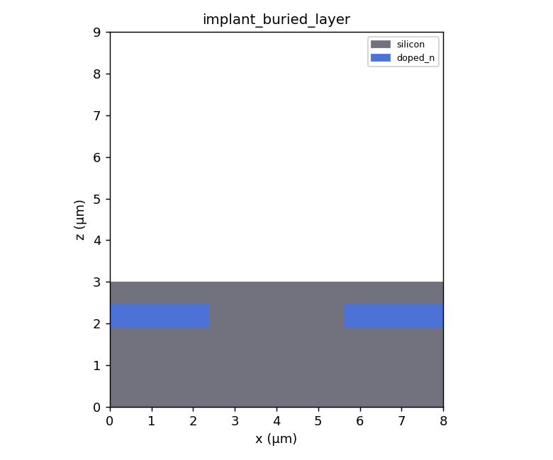
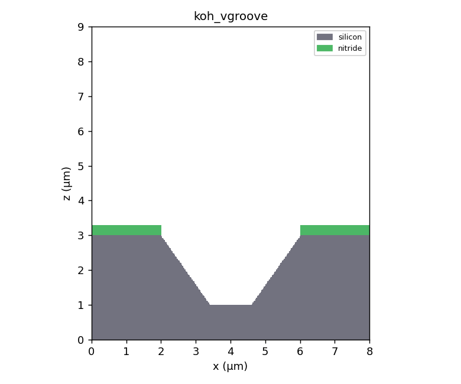
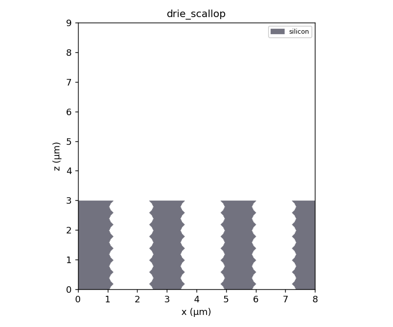
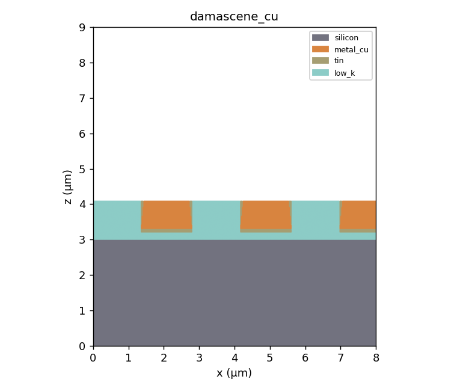
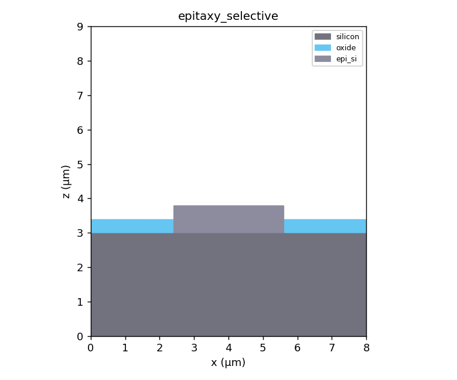
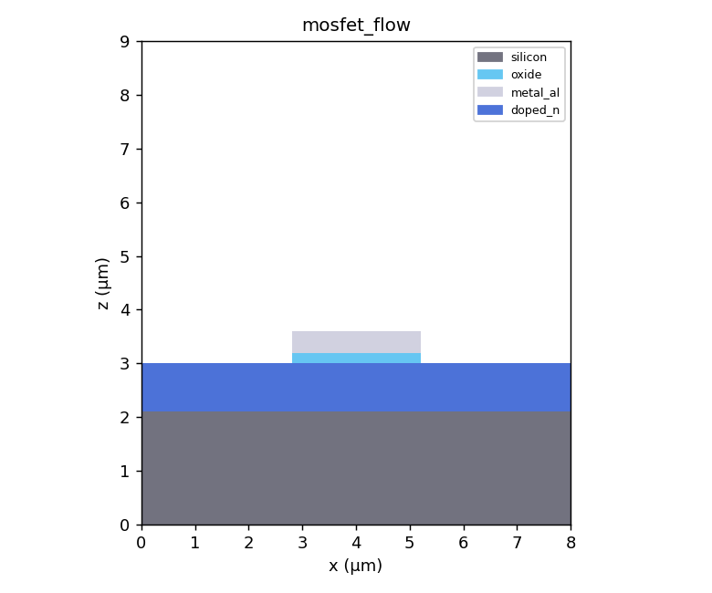

# 半導体プロセス 3D シミュレータ

ボクセルベースで半導体プロセス（フォトリソ・成膜・エッチング・拡散・酸化・CMP など）を
逐次適用し、3D / 2D 断面で確認できる Python 製シミュレータです。

## 特長

- **充填ボリューム表現**: 断面が空洞にならず、常に中身が詰まって表示されます。
- **自由な断面**: X / Y / Z / 角度指定 / マウス操作の任意断面。2D 断面ビューでは
  クリック 2 点で膜厚・CD を実寸（µm）測定できます。
- **豊富な工程**: PHOTO / CVD / PVD / DRY / WET / DIFFUSION / OXIDE / CMP / STRIP に加え、
  IMPLANT（イオン注入）/ ANNEAL（ドライブイン拡散）/ EPI（選択エピ成長）/
  KOH（異方性ウェット・斜め側壁）/ FILL（ダマシン埋込）/ LIFTOFF / DRIE（深掘りエッチ）/
  SPUTTER（イオンミリング）/ REFLOW（熱リフロー）/ CLEAN（プラズマクリーン）。
  材料は High-k(HfO₂)・TaN バリア・シリサイド(NiSi) など 16 種に対応。各材料は残留膜応力(MPa)を持ち、Stoney 則による等価ウェハ反りを計測できます。
- **任意角度パターン**: 回転矩形・帯・周期ライン（グレーティング）。
- **メトロロジ**: 膜厚マップ・段差・体積・アスペクト比・断面 CD に加え、表面粗さ(RMS)・側壁角・界面面積・トレンチ閉塞(ボイド)判定・ビア充填品質(`via_fill_quality`)・側壁ボーイング(`sidewall_bowing_um`)・段差被覆性(`conformality_pct`)・パターン密度(`pattern_density_map`/`pattern_density_stats`)・サーマルバジェット(`thermal_budget`)・膜応力とウェハ反り(`film_stress_thickness`/`wafer_bow_um`, Stoney 則)・ダマシンディッシング深さ(`dishing_depth_um`)・層間界面粗さ(`interface_roughness_um`)・接合深さと深さ方向ドーパントプロファイル(`junction_depth_um`/`dopant_depth_profile`)・表面凹凸の支配波長(`dominant_wavelength_um`, 2D FFT)・埋め込みボイドの連結成分統計(`void_metrics`: 個数/最大体積/縦方向高さ)・線幅ラフネス(`line_width_roughness_um`, LWR)・限界寸法均一性(`cd_uniformity`, CDU: 平均 CD/3σ/範囲)・導体の電気的導通/オープン判定(`electrical_continuity`, 連結成分が指定軸の両端に到達するか)・配線抵抗推定(`line_resistance_ohm`, 断面積を考慮した直列抵抗 R=Σρ·Δl/A, 細り箇所で増大・断線で inf)・DRC 最小間隔(`min_spacing_um`, 2 材料間の最小距離=ショート不良リスク, 接触で 0)・シート抵抗(`sheet_resistance_ohm_sq`, Rs=ρ/t, 4 探針相当の薄膜評価)・コンタクト面積/接触抵抗(`contact_area_um2`/`contact_resistance_ohm`, 面ペア数×pitch² と Rc=ρc/A)・寄生容量(`parasitic_capacitance_ff`, 面対向ライン走査による平行平板積算 C=Σε0·εr·pitch²/d。平行平板の解析値に厳密一致し配線間カップリング/対基板容量を評価。各材料の比誘電率 rel_permittivity を使用)・RC 遅延(`rc_delay_ps`, 集中定数 τ=R·C による配線遅延の一次見積り)・エッチ残渣/ストリンガー検出(`etch_residue_metrics`, 微小孤立片の個数/総体積/最大縦横比でブロックエッチ残り・側壁ストリンガーを判定)・アンダーカット検出(`undercut_um`, マスク開口に対する被加工材料の横方向後退量=等方/過剰サイドエッチ不良)・ピンホール検出(`pinhole_metrics`, 膜に囲まれた貫通抜けの個数/面積=カバレッジ/パーティクル起因リーク欠陥)・統合不良レポート(`defect_report`, ボイド/ピンホール/エッチ残渣/ディッシング/反りを横断検査した機械可読辞書, CLI `--json-report` の `defects` に統合)など計測ヘルパ（`semisim/metrology.py`）。
  人が読めるテキスト計測レポート（`metrology.report`）も生成できます。
- **プリセットレシピ**: 代表的な 13 フロー（ダマシン・MOSFET・LDD MOSFET・KOH・DRIE・TSV 貫通ビア・サリサイドゲート・薄化 3D-IC 等）をメニューから即読込（`semisim/presets.py`）。
- **設定の永続化**: 最後に使ったフォルダ・最近開いたレシピ・既定ウェハ設定・ウィンドウ位置を
  保存し次回起動時に復元（`semisim/settings.py`、`~/.semisim/settings.json`）。
- **アンドゥ / リドゥ**、レシピの JSON 保存 / 読込、STL エクスポート、スナップショット
  キャッシュ（上限付き）による高速プレビュー。

## セットアップ

Windows (PowerShell):

```powershell
py -m venv .venv
.\.venv\Scripts\Activate.ps1
pip install -r requirements.txt
```

Linux / macOS:

```bash
python3 -m venv .venv
source .venv/bin/activate
pip install -r requirements.txt
```

開発用ツール（pytest / ruff / mypy）も入れる場合:

```bash
pip install -e ".[dev]"
```

## 実行

```powershell
py main.py
```

### コマンドライン（GUI 不要）

レシピ JSON や組み込みプリセットをヘッドレスで実行し、計測レポートを表示できます。
CI やバッチ処理に便利です。

```powershell
# プリセットを実行してレポート表示
py -m semisim --preset "MOSFET フロー"

# プリセット一覧
py -m semisim --list-presets

# レシピ JSON を実行し、レポート・STL・断面 PNG を出力
py -m semisim recipe.json --report out.txt --stl shape.stl --png slice.png

# 中央列の縦方向材料スタックを CSV 出力（依存なし、SEM/TEM 断面比較用）
py -m semisim --preset "MOSFET フロー" --csv-column column.csv

# 特定材料を非表示にして PNG/STL 出力（例: 酸化膜を隠して下層を確認）
py -m semisim --preset "MOSFET フロー" --png cs.png --hide oxide,poly

# 2 パラメータ同時採引（実験計画法）。全組合せの計測値を CSV 出力
py -m semisim recipe.json --sweep2 "4.depth_um:0.3:0.7:0.2,5.taper_deg:0:30:15"

# 熱工程のサーマルバジェット（実効拡散長）を表示
py -m semisim --preset "拡散＋アニール" --thermal-budget
```

## テスト

エンジン部は GUI なしで完全にテストできます（pytest）。

```powershell
pytest
```

3D 可視化や処理結果の断面 PNG を生成して目視確認する場合:

```powershell
py tools\render_gallery.py
```

生成された PNG は `docs/gallery/` に出力されます。

## ギャラリー（断面例）

各プロセスを実行したウェハの中央断面（XZ 面）です。

| 例 | 内容 |
| --- | --- |
|  | イオン注入による埋込ドープ層（レジストで中央を遮蔽） |
|  | KOH 異方性エッチの V 溝（54.7° 側壁） |
|  | DRIE 深掘りトレンチ（側壁スキャロップ） |
|  | Cu ダマシン配線（TiN バリア＋CMP 平坦化） |
|  | 選択エピタキシャル成長（酸化膜開口部のみ） |
|  | 簡易 MOSFET フロー（ゲート＋ソース/ドレイン） |

## 使い方説明書（HTML）

各プロセス操作の断面スクリーンショットと説明・パラメータ・コード例をまとめた HTML マニュアルを `docs/manual/index.html` に用意しています（ブラウザで開いて閲覧）。再生成は次のコマンドです。

```
py tools/build_manual.py
```

## 工程一覧

| タイプ | 名称 | 概要 |
| --- | --- | --- |
| PHOTO | フォトリソ | レジスト塗布＋現像でパターニング |
| CVD | CVD 成膜 | 等方コンフォーマル成膜（負荷効果でパターン密度依存の膜厚変化に対応） |
| ALD | ALD 成膜 | サイクル数×1サイクル成長量で nm 精度の超コンフォーマル膜 |
| PVD | PVD 成膜 | 指向性成膜（段差被覆率でシャドーイング） |
| DRY | ドライエッチ | 異方性エッチ（垂直・オーバーエッチ対応） |
| WET | ウェットエッチ | 等方エッチ（アンダーカット） |
| DIFFUSION | 拡散 | 表面からの不純物拡散 |
| IMPLANT | イオン注入 | 投影飛程＋縦/横ストラグルのガウス濃度分布で埋込ドープ |
| ANNEAL | アニール | ドーパントのドライブイン（等方再分布） |
| RTP | 急速熱処理 | 浅く横拡散を抑えた活性化（スパイクアニール、`lateral_factor`で横/縦比を制御） |
| OXIDE | 熱酸化 | 露出 Si を消費し SiO₂ 成長（消費比は可変、既定 45/55 則） |
| SALICIDE | シリサイド形成 | 露出 Si／ポリ上のみ自己整合でシリサイド化（`react_poly`でゲート反応を制御） |
| SPACER | スペーサ形成 | コンフォーマル成膜＋異方性エッチバックで段差の垂直側壁にのみ材料を残す（ゲートスペーサ等） |
| EPI | エピ成長 | 露出シリコン上のみに選択的単結晶成長 |
| KOH | 異方性ウェット | 結晶面に沿った斜め側壁（V 溝・台形） |
| FILL | 埋込（ダマシン） | 開口・トレンチをボトムアップで金属充填。高 AR でキーホール空隙 |
| SPINON | スピンオン平坦化 | 全面を液状材料で覆い上面を平坦化（SOG/SOD） |
| DRIE | 深掘りエッチ | 高アスペクト比の深掘り（スキャロップ / RIE ラグ） |
| SPUTTER | スパッタエッチ | 材料非選択の指向性物理エッチ（イオンミリング、等方成分で横アンダーカット） |
| REFLOW | 熱リフロー | 角を丸めて表面を平滑化（モルフォロジ閉/開処理） |
| CLEAN | プラズマクリーン | 露出表面を薄く等方除去（デスカム／残渣除去） |
| LIFTOFF | リフトオフ | レジストとその上の膜を一括除去 |
| CMP | CMP 平坦化 | 上面研磨で平坦化（基板保護・研磨ストップ層対応） |
| BACKGRIND | 裏面研削 | 基板を裏面（底）から研削しウェハを薄化（3D-IC/パッケージ。デバイス層は保護） |
| STRIP | 剥離 | 指定材料を全除去 |

## 主なパラメータ解説

各工程の代表的なパラメータと物理的な意味は次のとおり。寸法はすべて µm 指定で、
内部的に `WaferConfig.pitch_um` でボクセル数へ丸められる（最小 1 ボクセル）。

| 工程 | パラメータ | 意味・効果 |
| --- | --- | --- |
| PHOTO | `polarity` | `positive`=開口部のレジストを除去 / `negative`=開口部以外を除去。空マスクは全面開口扱い |
| PHOTO | `edge_blur_sigma_um` | 光学解像度有限による角の丸め（OPC 前の生パターン）。マスクをガウスぼかし後に二値化（0=無効） |
| PVD | `step_coverage` | 0=完全シャドーイング（窪み底に成膜されない）/ 1=完全コンフォーマル。窪み深さに比例して膜厚を減衰 |
| PVD | `overhang` | オーバーハング / ブレッドローフィング。開口上端の隅が庇状に横へ張り出し、狭い開口では合体して上部を塞ぎキーホールボイドを残す（膜厚比、0=無効） |
| PVD | `tilt_deg` | 斜め蒸着の入射角（度, 鉛直から）。+x からの斜め入射で背の高い構造の風下側に影ができ膜が付かない（電子ビーム蒸着のシャドーイング/リフトオフ, 0=真上） |
| CVD | `loading` | 負荷効果（0〜1）。パターン密度（基板より高い列の割合）が高いほど反応種が枯渇して膜が薄くなる。0 で従来どおり一定厚 |
| CVD | `roughness_um` / `seed` | 成膜表面の RMS ラフネス（µm）。膜上面を平均 0・標準偏差 roughness_um のガウス分布で上下に揺らす。`seed` で再現可能（0=平滑） |
| DRY | `overetch_pct` / `lateral_um` / `selectivity` | ターゲット枯渇後に下層を削る割合（%）。0 で下層を保護。`lateral_um` でマスク下への横方向エッチバイアス（アンダーカット）を再現。`selectivity`（材料名→相対速度0〜1）で材料別エッチ選択比を再現し、ストップ層上で停止 |
| DRY | `mask_erosion` | マスク消耗比。ターゲットを depth 削る間にレジストが mask_erosion×depth だけ上面から減る（実機 0.3〜0.5） |
| DRY | `taper_deg` | 側壁テーパ角（度, 垂直から）。0=垂直。正で深さ d の後退量 d×tan(taper) の上広がり台形プロファイルを再現 |
| DRY | `notch_um` | RIE ノッチング。ストップ層（選択比で削れない下層）界面で帯電によりイオンが横偏向し、側壁直上が抉れる（SOI エッチ等の foot/notch、0=無効） |
| DRY | `arde_lag_um` | ARDE / RIE ラグ。狭い開口ほど供給律速で浅くなる。到達深さに係数 W/(W+arde_lag) を掛ける（W=局所開口幅, 0=無効） |
| WET | `targets` / `lateral_ratio` | エッチ対象材料。障壁材料は貫通しない（前線伝播でアンダーカット再現）。`lateral_ratio`（0〜1）で横アンダーカット/縦エッチ比を調整（1=完全等方、0=ほぼ垂直） |
| IMPLANT | `range_um` / `straggle_um` / `lateral_straggle_um` / `threshold` | 投影飛程 Rp と縦/横ストラグルのガウス濃度分布。`threshold`（既定 ±1.5σ 相当）以上を埋込ドープ。横ストラグルでマスク端の下へ回り込む。レジスト下は遮蔽 |
| IMPLANT | `channeling_fraction` / `tail_decay_um` | 結晶軸チャネリングによる Rp より深い指数裾。`channeling_fraction`（0〜1）が裾の相対振幅、`tail_decay_um`（0 で Rp×0.5）が減衰長 |
| IMPLANT | `tilt_deg` | 注入チルト角（0〜60°）。背の高いマスク/ゲートの +x 側に影（シャドーイング）を作り、注入領域を横へずらす（ハロー/ポケット/LDD の非対称分布を再現） |
| ANNEAL | `depth_um` / `time_min` / `temperature_c` | ドライブイン量を直接指定（等方）。`time_min>0` なら拡散長 L=√(D·t)（D は Arrhenius、ドーパント種別ごと）から深さを自動計算 |
| RTP | `depth_um` / `lateral_factor` | 急速熱処理。縦に depth、横に depth×lateral_factor だけ異方拡散（0=純垂直、1=等方） |
| OXIDE | `thickness_um` / `consume_fraction` | 生成 SiO₂ 厚と Si 消費割合（既定 0.45）。残りを上方成長（Deal–Grove 体積比）。ドープ Si も酸化 |
| OXIDE | `beak_fraction` | LOCOS バーズビーク。窒化膜マスク端の下へ酸化膜が横方向にテーパ侵入（0=無効） |
| OXIDE | `time_min` / `temperature_c` / `ambient` | Deal–Grove モード。`time_min>0` で thickness を無視し、酸化時間・温度・雰囲気（dry/wet）から x²+Ax=B(t+τ) で膜厚を物理計算 |
| SALICIDE | `thickness_um` | 露出 Si／ポリを消費して形成するシリサイド層の厚さ |
| SALICIDE | `react_poly` | ゲートポリシリコンも反応させるか（自己整合シリサイド、既定 True） |
| SPACER | `thickness_um` / `overetch_um` | 側壁スペーサの膜厚と異方性エッチバックのオーバーエッチ量 |
| EPI | `facet_angle_deg` | 選択エピの {111} ファセット形成（0=コンフォーマル）。高さとともに footprint が収束し台形/三角キャップを形成 |
| KOH | `side_wall_angle_deg` | 結晶面に沿う側壁角（既定 54.7°、(100)Si を想定） |
| FILL | `overfill_um` | 充填の盛り上げ量。ボトムアップで開口/トレンチを充填 |
| FILL | `void_ar` | キーホール空隙の AR しきい値（0=無効）。深さ/幅がこれを超える狭いトレンチ中心にボイドが残る |
| SPINON | `cap_um` / `planarization` | 最高点+キャップ厚まで全面を埋めて平坦化（FILL と違い空列も覆う）。`planarization`（0〜1, DOP）で平坦化度を調整（1=完全平坦、0=地形追従のコンフォーマル） |
| DRIE | `scallop_pitch_um` | Bosch サイクルに対応するスキャロップ周期 |
| DRIE | `lag` | RIE ラグ / ARDE（0〜1）。開口が狭いほどエッチが浅くなる（アスペクト比依存エッチ） |
| DRIE | `redeposit_um` | 側壁再付着 / パシベーション（Bosch）。エッチ生成物がトレンチ側壁に再堆積して幅を狭める（0=無効） |
| DRIE | `microtrench_um` | マイクロトレンチング。側壁反射イオンが集中するトレンチ底の隅（フット）が局所的に深く掘れる（0=無効） |
| SPUTTER | `depth_um` / `isotropic` | 物理ミリング量と横方向成分（0=純垂直 / 1=深さと同等のアンダーカット）。基板最下層は保護 |
| SPUTTER | `faceting` | 入射角依存スパッタによる凸角の面取り（0=無効 / 1=深さ相当の角削り）。鋭い角に約45°ファセットを形成 |
| CLEAN | `target` / `thickness_um` | 対象材料を表面から等方的に薄く除去 |
| REFLOW | `target` / `radius_um` | 平滑化半径。モルフォロジ処理で角を丸める |
| ALD | `cycles` / `growth_per_cycle_nm` | サイクル数×1サイクル成長量で膜厚を nm 精度に制御。超コンフォーマル |
| ALD | `ar_coverage` / `ar_threshold` | 高アスペクト比窪みでの底被覆率（前駆体枯渇）。1.0=完全コンフォーマル |
| CMP | `remove_um` / `stop_material` / `soft_material` / `dishing_um` | 研磨量と研磨ストップ層（指定時はその最高点より下を削らない）。`soft_material`＋`dishing_um` で軟材料（Cu 等）をディッシング量だけ追加で凹ませるダマシン研磨を再現 |
| CMP | `erosion_um` / `density_radius_um` | パターン密度依存エロージョン。軟材料が密集する領域ほど余分に削れる（密度を `density_radius_um` 近傍で平均） |
| BACKGRIND | `thin_um` | 裏面からの基板研削量。全構造を下方へシフトして底の基板を除去（最低 1 ボクセルの基板を残しデバイスを保護） |

## 構成

| モジュール | 役割 |
| --- | --- |
| `semisim/materials.py` | 材料定義（ID・色・属性） |
| `semisim/grid.py` | ボクセルグリッド（Wafer） |
| `semisim/masks.py` | フォトマスク図形（分数座標 0..1） |
| `semisim/processes.py` | 各プロセス工程のロジック |
| `semisim/metrology.py` | 計測・解析ヘルパ |
| `semisim/recipe.py` | レシピ管理・シミュレーション・保存/読込 |
| `semisim/presets.py` | 組み込みプリセットレシピ（レシピライブラリ） |
| `semisim/settings.py` | アプリ設定の永続化（最近のレシピ・既定設定） |
| `semisim/export.py` | ボクセル形状を STL メッシュへ書き出し（追加依存なし） |
| `semisim/visualize.py` | PyVista / matplotlib 可視化ヘルパ |
| `semisim/gui.py` | PyQt5 + PyVista GUI 本体 |
| `tests/` | pytest テスト一式 |
| `tools/render_gallery.py` | 断面 PNG ギャラリ生成（目視確認用） |
| `samples/` | サンプルレシピ JSON |

## 座標規約

`grid[z, y, x]`。z は高さ（0 が基板底、増加方向が上＝膜成長方向）。x, y は面内。
ボクセル 1 辺の物理長は `WaferConfig.pitch_um`。

## 技術選定について（言語）

本シミュレータは Python を採用しています。理由は次のとおりです。

- **数値計算エコシステム**: ボクセル演算は NumPy のベクトル化と SciPy の
  `ndimage`（距離変換・モルフォロジ・フィルタ）に強く依存しており、これらは
  C/Fortran 実装で十分高速です。中核ループはすでに配列演算化されています。
- **可視化**: PyVista(VTK) による 3D、matplotlib による 2D 断面が即利用でき、
  プロトタイピングと検証が速いです。
- **十分な性能**: 高解像度（0.025µm 格子, 320³ 級）でもギャラリー全 8 フローが
  数十秒で完了します。対話操作向けには中解像度プリセットを用意しています。

将来さらに大規模・高速化が必要になった場合は、ホットスポット（反復モルフォロジ等）を
Rust(PyO3) / C++ 拡張や Numba/Cython でオフロードする構成が現実的で、
全面的な別言語への移植より費用対効果が高いと判断しています。
